# Codex Engineering Playbook

> Codex をゼロから構築し、Addy Osmani の `agent-skills` を開発ライフサイクルの基盤、Matt Pocock の skills を設計・ドメイン思考の補完として使うための運用標準。
>
> 方針は「高品質だが過剰プロセスにしない」「1セッション1モデル」「必要な context だけ読む」「skills は工程、AGENTS.md は恒久ルール」。

---

# 0. 結論

推奨構成は次の通り。

```text
Codex
│
├─ Global AGENTS.md
│   ├─ Git安全性
│   ├─ シンプルな設計
│   ├─ context hygiene
│   ├─ source grounding
│   ├─ test philosophy
│   ├─ verification honesty
│   ├─ model/session policy
│   └─ subagent policy
│
├─ Addy Osmani / agent-skills
│   └─ 開発ライフサイクル全体
│      Define → Plan → Build → Verify → Review → Ship
│
├─ Matt Pocock / skills
│   ├─ grill-with-docs
│   ├─ domain-modeling
│   ├─ codebase-design
│   ├─ wayfinder
│   ├─ handoff
│   └─ setup-matt-pocock-skills
│
└─ Model strategy
    ├─ Luna  = 小さく明確で安価に完結する仕事
    ├─ Terra = 通常開発のデフォルト
    └─ Sol   = 複雑・曖昧・高リスク
```

重要ルールは5つ。

1. **1セッション = 原則1モデル**
2. **1実装セッション = 原則1つの明確な task / vertical slice**
3. **モデルを上げるなら同一セッションで変更せず、新しいセッションへ handoff**
4. **AGENTS.md に workflow を詰め込みすぎず、workflow は Skills に任せる**
5. **「全部読む・全部テストする・全部レビューする」を毎回やらない。必要な範囲から始める**

Codex は会話履歴を次ターンの prompt に含めるため長いセッションほど context が増える。またモデル変更は model-specific instructions が変化するため prompt cache miss の原因になると OpenAI が明示している。したがって「同じ問題は同じセッション・同じモデル」「問題またはモデルが変わるなら新しいセッション」が基本になる。

---

# 1. ゼロから Codex を構築する

## 1.1 Codex

使用するクライアントは以下のどれでもよい。

- Codex Desktop
- Codex CLI
- Codex IDE extension
- Codex Web

ChatGPT アカウントでサインインして利用する。

Addy の native Codex plugin を使う場合、現行 upstream は Codex CLI v0.122+ を要求している。

確認：

```bash
codex --version
```

---

# 2. Skills をインストールする

## 2.1 Addy Osmani / agent-skills

これは**ベースパック**として丸ごと入れる。

理由：

- Codex native plugin
- 24 skills を一括管理
- shared references を含めて利用可能
- production lifecycle 全体をカバー
- 必要な skill/reference だけ読む progressive disclosure 型

現在の Codex 用 upstream 手順：

```bash
codex plugin marketplace add addyosmani/agent-skills
codex plugin add agent-skills@agent-skills
```

インストール後は**新しい Codex セッションを開始する**。Addy の Codex integration は root の `skills/` を直接 plugin として提供し、全24 skills が利用可能になる。

個別に `npx skills add ... --skill ...` するより native plugin を推奨する。個別コピーでは repo-level `references/` が付属しないケースが upstream で明記されている。

---

## 2.2 Matt Pocock / skills

Matt は全部入れない。

Addy と競合しにくく、Addy が弱い領域だけ追加する。

推奨：

```text
setup-matt-pocock-skills
grill-with-docs
domain-modeling
codebase-design
wayfinder
handoff
```

導入：

```bash
npx skills@latest add mattpocock/skills
```

installer で上記 skills と Codex を選ぶ。

Matt の skills は Codex では native plugin ではなく project files としてインストールされ、必要なタイミングで自分で update する方式。upstream も native Codex plugin は roadmap としている。

各 repo で一度：

```text
setup-matt-pocock-skills
```

を実行する。

これは issue tracker、triage labels、domain docs の場所などを repo ごとに設定する。

---

# 3. Skill 呼び出し記法について

ここは Codex のバージョン・導入方式で表記差がある。

Addy の現行 Codex docs は、

```text
@spec-driven-development
```

のような `@skill-name` を案内している。

一方 OpenAI の現行公式ドキュメントには、

```text
$openai-docs
```

のような `$skill-name` の例も存在する。

したがって、この playbook では**skill名自体を正とする**。

実際には Codex の autocomplete / skill picker に表示される形式を使用する。

例：

```text
spec-driven-development
planning-and-task-breakdown
incremental-implementation
grill-with-docs
```

---

# 4. Global AGENTS.md

配置：

```text
~/.codex/AGENTS.md
```

Codex は global instructions と repo 内の `AGENTS.md` を階層的に組み合わせ、より深い directory の指示をより具体的な instruction として扱う。

Global には**全プロジェクト共通の不変ルール**だけを書く。

Workflow は Skills に任せる。

推奨：

```md
## Git / GitHub
- Only perform remote-modifying operations such as push, PR creation, or merge when explicitly requested by the user.
- When push or PR creation is requested, use the required network permissions from the start. Do not first attempt the operation in a network-restricted environment.
- After creating a PR, verify it with `gh pr view`.

## Development Practices
- Prefer the simplest implementation that fully satisfies the current requirements. Avoid speculative abstractions, configuration, indirection, and extension points for hypothetical future needs.
- Grow the system in thin, working vertical slices. Each increment should leave the product in a working, testable state.
- Prefer cohesive, deep modules with small interfaces over layers of shallow wrappers or pass-through abstractions. Introduce a seam only when behavior actually varies across it.
- Reuse existing project patterns, utilities, and dependencies before introducing new ones. Before implementing a pattern, inspect at least one relevant existing example when available.
- Prefer established, well-maintained libraries when they reduce overall complexity or improve reliability. Do not reimplement common functionality without a clear reason.
- For framework- or library-specific behavior, verify the installed version, types, and current official documentation or authoritative source before implementing. Do not rely on memory for version-sensitive APIs.
- Treat hard-to-reverse architectural decisions deliberately. Prefer simple, reversible choices for everything else.
- Do not preserve backward compatibility unless it is an explicit requirement or existing project constraint. Prefer removing obsolete paths over adding compatibility layers, fallbacks, dual implementations, or speculative migrations.

## Context and Requirements
- Before editing code, read the files being changed, their relevant tests, involved types/interfaces, and one similar implementation when available.
- Load only context relevant to the current task. Do not broadly reread the repository or large specifications when a focused subset is sufficient.
- Do not invent missing product requirements. If the specification, project documentation, and existing code materially disagree, surface the contradiction instead of silently choosing an interpretation.
- Use the project's established domain terminology consistently. If a `CONTEXT.md`, glossary, ADR, or equivalent domain documentation exists, treat it as authoritative for vocabulary and recorded architectural decisions.

## Testing and Verification
- Test externally observable behavior through stable interfaces rather than implementation details.
- For bug fixes, reproduce the failure with an automated test when practical before applying the fix.
- Prefer real implementations and lightweight fakes over interaction-heavy mocks. Mock only at meaningful external seams or where real dependencies are slow, unsafe, or nondeterministic.
- Before claiming an implementation is complete, run the repository's relevant verification commands. At minimum, use the smallest applicable tests and type/build/lint checks; use runtime verification when correctness depends on runtime behavior.
- Never claim that tests, builds, or checks pass unless they were actually run successfully. Report any checks that could not be run.

## Model and Session Policy
- Treat one Codex session as one model by default. Do not switch the active session's model merely to reduce cost.
- If a task requires a materially different model capability, preserve the relevant state in durable artifacts or a concise handoff and start a fresh session with the new model.
- Prefer `gpt-5.6-terra` for ordinary engineering work.
- Prefer `gpt-5.6-luna` only for bounded, low-risk work that is expected to complete entirely with Luna.
- Escalate ambiguous, cross-cutting, architectural, security-sensitive, data-loss-sensitive, or repeatedly failing work to `gpt-5.6-sol` in a fresh session.
- Do not repeatedly retry a task with a weaker model when one clean escalation is more efficient.

## Agent Delegation
- The parent model owns task interpretation, decomposition, integration decisions, and final verification.
- Delegate bounded, independently verifiable work such as codebase exploration, documentation research, reproduction-test creation, log analysis, and isolated implementation tasks to `gpt-5.6-luna` when useful.
- Give subagents narrow scope, relevant context, explicit success criteria, and expected verification. Do not delegate an ambiguous goal without defining the boundary.
- Do not spawn multiple subagents for work that one well-scoped subagent can complete.
- Subagents should return concise findings, changed-file summaries, verification evidence, and unresolved risks instead of large code or log dumps.
- The parent should inspect relevant or high-risk changes and integrate subagent results rather than repeatedly rereading the full diff.
- Minimize parent ↔ subagent review loops. Prefer one well-scoped delegation followed by parent integration and final verification.
```

OpenAI の現行 GPT-5.6 guidance も、system prompt は lean にし、同じ指示を繰り返さない方が token consumption と cost の両面で有利と説明している。

---

# 5. Project AGENTS.md

Global と重複させない。

repo root の `AGENTS.md` には以下だけを書く。

```text
stack
commands
architecture map
directory roles
project-specific conventions
external boundaries
test commands
known traps
```

例：

```md
# Project Instructions

## Stack
- Next.js 16
- React 19
- TypeScript
- PostgreSQL
- Drizzle
- Vitest
- Playwright

## Commands
- Unit tests: `pnpm test`
- Typecheck: `pnpm typecheck`
- Lint: `pnpm lint`
- Build: `pnpm build`
- E2E: `pnpm test:e2e`

## Structure
- `src/domain/`: domain logic
- `src/app/`: application/UI layer
- `src/db/`: persistence
- `tests/`: integration tests

## Boundaries
- Domain code must not import framework-specific modules.
- Database access goes through `src/db/`.
- Browser-only code must remain outside the domain layer.

## Project Conventions
- Use "Workspace" for the billing boundary.
- Do not introduce a synonym such as "Organization".
```

---

# 6. Codex に入れる Skills

# Addy — 全24 skills を plugin としてインストール

インストールは全部でよい。

ただし、毎回全部を明示起動しない。

Addy は workflow・verification gate・anti-rationalization を各 skill に持ち、supporting references は必要時のみ読む設計。

## 日常的に使う Core Skills

| Skill | 主な用途 |
|---|---|
| `using-agent-skills` | 何を使うか分からない |
| `spec-driven-development` | 中規模以上の変更を仕様化 |
| `planning-and-task-breakdown` | 実装可能な task に分解 |
| `incremental-implementation` | vertical slice で実装 |
| `test-driven-development` | behavior を test-first で変更 |
| `context-engineering` | context が多い・既存 repo に入る |
| `source-driven-development` | framework/library API を扱う |
| `debugging-and-error-recovery` | 原因不明の failure |
| `code-review-and-quality` | merge 前 review |
| `frontend-ui-engineering` | UI 開発 |

## 条件付きで使う Skills

| Situation | Skill |
|---|---|
| API / public interface | `api-and-interface-design` |
| Browser runtime | `browser-testing-with-devtools` |
| 高リスク判断の再検証 | `doubt-driven-development` |
| 動くが複雑 | `code-simplification` |
| Auth / user input / secrets | `security-and-hardening` |
| 遅い | `performance-optimization` |
| Git / version strategy | `git-workflow-and-versioning` |
| CI/CD | `ci-cd-and-automation` |
| 古いAPI撤去 | `deprecation-and-migration` |
| ADR / public docs | `documentation-and-adrs` |
| production telemetry | `observability-and-instrumentation` |
| deploy / rollout | `shipping-and-launch` |

Addy の全24 skills は Define → Plan → Build → Verify → Review → Ship の lifecycle に分類されている。

---

# 7. Matt から追加する Skills

## `grill-with-docs`

使う場面：

```text
何を作るべきかまだ曖昧
+
domain terminology が重要
+
hard-to-reverse decision がある
```

例：

```text
grill-with-docs

チーム型SaaSに招待機能を追加したい。
実装前にdomain language、権限モデル、edge cases、
failure cases、hard-to-reverse decisionsを詰めたい。
```

---

## `domain-modeling`

使う場面：

```text
User / Account / Workspace / Organization
```

などの意味が曖昧、または同じ概念に複数名が存在するとき。

目的：

```text
言葉を決める
↓
CONTEXT.md / glossary に残す
↓
spec / code / tests / tickets の語彙を統一
```

---

## `codebase-design`

使う場面：

```text
module boundary
interface
adapter
test seam
abstraction
```

を設計するとき。

中心原則：

```text
Deep module
=
small interface
+
complexity hidden inside
```

Matt の skill は module/interface/depth/seam/adapter などの共通 vocabulary を提供する。

---

## `wayfinder`

使う場面：

```text
実装計画を作る前に、
「何を決めればいいか」自体が分からない
```

例：

```text
monolith → multi-tenant
authentication redesign
巨大 migration
大規模 architecture replacement
```

普通の feature には使わない。

---

## `handoff`

使う場面：

- モデルを変更する
- session が長くなった
- task を別 session に移す
- 作業を翌日に持ち越す
- 別 agent に渡す

Matt の handoff は既存 spec/ADR/commit/diff を再コピーせず、現在の live context だけを圧縮する設計。

---

# 8. モデル戦略

OpenAI の現行位置付け：

```text
Sol   = frontier capability
Terra = intelligence / cost balance
Luna  = efficient high-volume workloads
```


推奨：

| Task | Model |
|---|---|
| rename / mechanical edit | Luna |
| docs lookup | Luna |
| log analysis | Luna |
| 明確な小bug | Luna / Terra |
| 通常feature | Terra |
| TDD implementation | Terra |
| 普通のrefactor | Terra |
| frontend実装 | Terra |
| architecture | Sol |
| requirements が曖昧 | Sol |
| cross-cutting design | Sol |
| difficult debugging | Sol |
| security-sensitive design | Sol |
| data-loss-sensitive migration | Sol |
| Terra が繰り返し失敗 | 新しい Sol session |

---

# 9. 絶対ルール：1セッション1モデル

```text
悪い

Session A
Sol
 ↓
Lunaへ変更
 ↓
Terraへ変更
 ↓
Solへ戻す
```

Codex は prompt の exact-prefix cache を利用しており、モデル変更は cache miss の原因になる。

代わりに：

```text
Session A / Sol
requirements + design
↓
spec / ADR / ticket

        SESSION BOUNDARY

Session B / Terra
ticket 1 implementation
↓
tests
↓
verification

        SESSION BOUNDARY

Session C / Terra
ticket 2
```

難しくなったら：

```text
Terra
↓
事実を整理
↓
handoff
↓
新しい Sol session
```

---

# 10. Subagent は「モデル変更」とは別

これは有効。

```text
Parent: Terra
│
├─ Luna subagent
│   └─ docs research
│
├─ Luna subagent
│   └─ log analysis
│
└─ Parent: Terra
    └─ integrate + verify
```

Parent の session model は Terra のまま。

ただし subagent もコストを消費する。

したがって：

```text
3 agents × 同じ調査
```

ではなく、

```text
1 agent × 明確な調査範囲
```

を優先する。

---

# 11. Master Decision Flow

```mermaid
flowchart TD

A[新しい依頼] --> B{既存repoの理解が不足?}

B -- Yes --> C[context-engineering]
B -- No --> D{巨大で意思決定自体が未整理?}

C --> D

D -- Yes --> E[Sol session: wayfinder]
E --> F[Decision artifacts]
F --> G[新しいsession]

D -- No --> H{Requirementsは明確?}

G --> H

H -- No --> I{Domain language / hard decisionが重要?}

I -- Yes --> J[Sol: grill-with-docs + domain-modeling]
I -- No --> K[interview-me / idea-refine]

J --> L{変更はtrivial?}
K --> L
H -- Yes --> L

L -- Yes --> M[Luna or Terraで直接実装]
L -- No --> N[spec-driven-development]

N --> O{複数taskに分かれる?}

O -- Yes --> P[planning-and-task-breakdown]
O -- No --> Q[新しい implementation session]
P --> Q

Q --> R[Terra: incremental-implementation]

R --> S{Behavior変更?}
S -- Yes --> T[test-driven-development]
S -- No --> U[実装]

T --> U

U --> V{Framework/library API?}
V -- Yes --> W[source-driven-development]
V -- No --> X{Frontend?}

W --> X

X -- Yes --> Y[frontend-ui-engineering + runtime verification]
X -- No --> Z{Failure / unexpected behavior?}

Y --> Z

Z -- Yes --> AA[debugging-and-error-recovery]
Z -- No --> AB[Targeted verification]

AA --> AB

AB --> AC{Security-sensitive?}
AC -- Yes --> AD[security-and-hardening]
AC -- No --> AE{Performance-sensitive?}

AD --> AE

AE -- Yes --> AF[performance-optimization]
AE -- No --> AG[code-review-and-quality]

AF --> AG

AG --> AH{Production release?}

AH -- Yes --> AI[observability + shipping-and-launch]
AH -- No --> AJ[Done]

AI --> AJ
```



---

# 12. 最初の Yes / No チートシート

```text
Q1. 何を作るか明確？
│
├─ NO
│   ├─ domain/architectureも曖昧？
│   │      YES → grill-with-docs
│   │      NO  → interview-me / idea-refine
│   │
│   └─ 巨大すぎて決めるべきこと自体が不明？
│          YES → wayfinder
│
└─ YES
    ↓

Q2. 1ファイル程度・結果が完全に明確？
│
├─ YES → Luna/Terraで直接変更 + targeted verification
│
└─ NO
    ↓

Q3. 数時間以上 / 複数コンポーネント？
│
├─ YES → spec-driven-development
│          ↓
│        planning-and-task-breakdown
│
└─ NO → implementationへ
    ↓

Q4. Behaviorを変える？
│
├─ YES → test-driven-development
└─ NO  → implementation
    ↓

Q5. framework/library API に依存？
│
├─ YES → source-driven-development
└─ NO
    ↓

Q6. browser UI？
│
├─ YES → frontend-ui-engineering
│          + browser runtime verification
└─ NO
    ↓

Q7. 想定外のfailure？
│
├─ YES → debugging-and-error-recovery
└─ NO
    ↓

Q8. security risk？
│
├─ YES → security-and-hardening
└─ NO
    ↓

Q9. performance requirement？
│
├─ YES → performance-optimization
└─ NO
    ↓

code-review-and-quality
    ↓

Q10. productionに出す？
│
├─ YES → observability-and-instrumentation
│          → shipping-and-launch
└─ NO → Done
```

---

# 13. セッションを新しくするタイミング

## 新しい session を作る

以下のどれかなら原則 YES。

```text
□ モデルを変える
□ ticket が変わる
□ feature が変わる
□ design → implementation に移る
□ implementation → 独立した高リスクreviewに移る
□ contextが長くなった
□ 過去の探索情報の大半が不要になった
□ agentが昔の前提を引きずっている
□ 同じ失敗を繰り返している
□ 別方向のprototype/researchを始める
```

必要なら：

```text
handoff
```

を使う。

---

## 同じ session を維持する

```text
□ 同じticket
□ 同じモデル
□ 同じ目標
□ test → fix → test の短いloop
□ 直前に読んだcontextがまだほぼ全部必要
□ failureをlocalizeしている途中
```

---

# 14. Greenfield の標準フロー

```text
Session 1 / Sol
────────────────────
grill-with-docs
domain-modeling
必要なら codebase-design

↓
spec-driven-development

↓
planning-and-task-breakdown


Session 2 / Terra
────────────────────
Task 1
incremental-implementation
test-driven-development
source-driven-development
verification


Session 3 / Terra
────────────────────
Task 2
...


最後
────────────────────
code-review-and-quality

必要なら
security-and-hardening
performance-optimization
observability-and-instrumentation
shipping-and-launch
```

---

# 15. 小さい変更

例：

- typo
- button label
- CSS微修正
- 明確な validation
- simple rename
- 小さい test fix

```text
Session / Luna
────────────────
関連ファイルを読む
↓
変更
↓
最小test/typecheck
↓
Done
```

原則不要：

```text
spec
plan
wayfinder
security review
performance review
full suite
```

---

# 16. 普通の Feature

例：

```text
検索結果にfilterを追加
プロフィール編集
画像アップロード
notification設定
```

Requirements が十分明確なら：

```text
Session A / Terra or Sol
spec-driven-development
↓
planning-and-task-breakdown
```

Task ができたら session を切る。

```text
Session B / Terra
Task 1
incremental-implementation
↓
test-driven-development
↓
verification
```

```text
Session C / Terra
Task 2
...
```

---

# 17. 複雑な Feature

例：

```text
Team invite
permissions
billing
workflow engine
async jobs
```

```text
Session A / Sol
grill-with-docs
↓
domain-modeling
↓
必要なら codebase-design
↓
spec-driven-development
↓
planning-and-task-breakdown
```

その後：

```text
1 Task
=
1 fresh Terra session
```

---

# 18. 超大型案件

例：

```text
single tenant → multi tenant
auth全面移行
DB再設計
monolith分割
大規模migration
```

いきなり spec を作らない。

```text
Session 1 / Sol
wayfinder
↓
Decision A
Decision B
Decision C
...
```

意思決定が解決したあと：

```text
新しい Sol session
↓
spec-driven-development
↓
planning-and-task-breakdown
```

さらに：

```text
Taskごとに fresh Terra session
```

---

# 19. Bug

## 原因が明確

```text
Session / Luna or Terra
test-driven-development
↓
failing regression test
↓
fix
↓
test
```

---

## 原因不明

```text
Session / Terra
debugging-and-error-recovery
```

基本：

```text
reproduce
↓
localize
↓
reduce
↓
fix
↓
guard
```

複雑で詰まったら同じ session を Sol に変更しない。

```text
Terraで確認済み事実
↓
handoff
↓
fresh Sol session
```

---

# 20. Framework / Library を使う仕事

例：

```text
Next.js
React
Stripe
OpenAI SDK
Cloudflare
Supabase
Drizzle
Prisma
```

必ず：

```text
source-driven-development
```

判断順：

```text
package.json / lockfile
↓
installed version
↓
types
↓
official documentation
↓
implementation
```

「モデルが知っているAPI」を根拠にしない。

---

# 21. Frontend

```text
Session / Terra
frontend-ui-engineering
↓
implementation
↓
browser-testing-with-devtools
↓
console
network
DOM
accessibility
responsive behavior
loading/error/empty states
```

視覚的に正しいことは source code だけでは証明できない。

Browser runtime で確認する。

---

# 22. API / Interface

外部契約：

```text
api-and-interface-design
```

内部 module/interface：

```text
codebase-design
```

使い分け：

```text
HTTP API
public SDK
events
external contracts
      ↓
api-and-interface-design


internal module
test seam
adapter
abstraction boundary
      ↓
codebase-design
```

---

# 23. Brownfield / Legacy Repo

いきなり architecture refactor しない。

```text
Session 1 / Terra
context-engineering
↓
repo map
↓
tests
↓
existing patterns
↓
boundaries
```

次に小さい既存問題：

```text
debugging-and-error-recovery
↓
regression tests
```

その後に：

```text
code-simplification
codebase-design
api-and-interface-design
```

---

# 24. Security

以下を含むなら security review の候補。

```text
auth
authorization
user input
file upload
secrets
payments
webhook
SQL
external integrations
sensitive data
```

```text
security-and-hardening
```

ただし trivial CSS change に毎回 security skill を走らせない。

---

# 25. Performance

「速くして」でコードをいきなり変更しない。

```text
performance-optimization
```

基本：

```text
measure
↓
identify bottleneck
↓
change
↓
measure again
```

---

# 26. Production Release

Production へ出す場合：

```text
code-review-and-quality
↓
security-and-hardening   # relevantなら
↓
performance-optimization # relevantなら
↓
observability-and-instrumentation
↓
shipping-and-launch
```

---

# 27. Cost Optimization

## 原則1

**Sol に repo 探索を長時間させない。**

---

## 原則2

**Luna で始めたタスクは Luna で完結できるものにする。**

良い：

```text
rename
docs lookup
log analysis
mechanical change
small test
```

悪い：

```text
Lunaで巨大feature開始
↓
途中でTerra
↓
途中でSol
```

---

## 原則3

通常開発は Terra をデフォルトにする。

```text
Explore
↓
Implement
↓
Test
↓
Verify
```

を同じ Terra session で完結させる。

---

## 原則4

Sol は escalation。

```text
architecture
ambiguous domain
high risk
difficult debugging
security design
migration risk
repeated Terra failure
```

---

## 原則5

Context を絞る。

読む順番：

```text
1. 変更対象
2. relevant tests
3. types/interfaces
4. existing similar example × 1
5. 必要なspec section
```

避ける：

```text
repo全部
docs全部
全spec
全git history
全tests
```

OpenAI の現行 guidance でも、leaner prompts は internal coding-agent eval で token と cost の大幅削減につながったとされている。

---

# 28. Test Cost Optimization

開発中：

```text
single test
↓
relevant test group
```

feature 完了：

```text
typecheck
lint
relevant integration tests
```

PR / release：

```text
full suite
build
必要ならE2E
```

毎編集で full E2E を実行しない。

---

# 29. Subagent Cost Optimization

使う：

```text
repo exploration
official docs research
log analysis
reproduction test creation
isolated implementation
```

使わない：

```text
同じ調査を5agent
曖昧なfeature丸投げ
architecture丸投げ
最終verification丸投げ
```

Delegation の理想：

```text
Parent
↓
「この1点を調査」
↓
Luna
↓
5〜10行程度のfindings
↓
Parent integrate
```

---

# 30. Prompt Templates

## 曖昧な Feature

```text
grill-with-docs

この機能を追加したい。

まだ実装しない。
まず requirements、domain terminology、failure cases、
testing seams、hard-to-reverse decisions を詰めたい。
既存コードと既存ドキュメントも確認して進めて。
```

---

## Spec

```text
spec-driven-development

ここまで合意した内容を、
implementation-ready な spec にしてください。

既存 architecture と testing seams を尊重し、
未解決事項は勝手に仮定しないでください。
```

---

## Plan

```text
planning-and-task-breakdown

このspecを実装可能なtaskに分割してください。

各taskは可能な限り独立して検証可能な
thin vertical sliceにしてください。
```

---

## Implementation

```text
incremental-implementation

Task 03 を実装してください。

関連spec、AGENTS.md、CONTEXT.md、ADRをsource of truthとして扱う。
まず対象コード、関連test、interface、類似実装を確認。
変更後は最小のrelevant verificationを実行する。
```

---

## Framework Work

```text
source-driven-development

このtaskを実装してください。

framework/library固有の判断については、
installed version、types、現在のofficial documentationを確認し、
モデルの記憶だけでAPIを決めないでください。
```

---

## Debug

```text
debugging-and-error-recovery

症状:
<症状>

推測でfixを始めないでください。

まず再現可能なfeedback loopを作り、
localizeしてから最小修正を行い、
regression testを残してください。
```

---

## Review

```text
code-review-and-quality

この変更をmerge前レビューしてください。

correctness、readability、architecture、
security、performanceを確認し、
実際に修正すべきものだけseverity付きで報告してください。
```

---

## Handoff

```text
handoff

次のsessionでは、
<次にやること>
を進めます。

既存のspec、ADR、commit、diffを重複コピーせず、
次のagentが必要なlive contextだけを残してください。
```

---

# 31. 「Skills を使わない」判断も重要

以下に full workflow は不要。

```text
typo
one-line fix
明確なrename
コメント修正
小さなstyle修正
既知patternの機械的変更
```

Skills は quality を上げるための workflow であり、儀式ではない。

---

# 32. Skill の競合を避ける

重複しているものは役割を決める。

## Requirements

```text
Simple underspecified ask
→ interview-me

Domain/architecture含む重要な曖昧さ
→ grill-with-docs
```

---

## Architecture

```text
External contract
→ api-and-interface-design

Internal module/seam
→ codebase-design
```

---

## Planning

```text
Addy:
planning-and-task-breakdown
```

を基本とする。

Matt の `to-tickets` は入れない。

必要になった場合のみ後から導入する。

Matt の `to-tickets` は tracer-bullet vertical slice と fresh context を強く要求する良い skill だが、Addy planning と責務が重複する。

---

# 33. 推奨 Repository Structure

必須ではないが、長期運用では次のような durable artifacts を推奨。

```text
repo/
├─ AGENTS.md
├─ CONTEXT.md
│
├─ docs/
│  ├─ architecture/
│  ├─ adr/
│  ├─ specs/
│  └─ research/
│
├─ tasks/
│
└─ src/
```

役割：

```text
AGENTS.md
= agent operating rules

CONTEXT.md
= domain terminology

ADR
= hard-to-reverse decisions

spec
= what / why / acceptance criteria

tasks
= implementable units

code
= current implementation
```

会話履歴を project memory にしない。

---

# 34. Definition of Done

通常変更：

```text
□ requirementを満たす
□ obsolete pathを残していない
□ existing patternを不必要に壊していない
□ relevant testsを実行
□ relevant type/build/lintを実行
□ runtime依存ならruntimeで確認
□ 実行していないcheckをpassと報告していない
```

Production-sensitive：

```text
□ security implications確認
□ rollback可能
□ observabilityあり
□ deployment / rollout計画あり
```

---

# 35. 日常運用の最短チートシート

```text
何を使うか分からない
→ using-agent-skills


要件が曖昧
→ grill-with-docs


巨大案件
→ wayfinder


domain用語が曖昧
→ domain-modeling


module/interface設計
→ codebase-design


仕様化
→ spec-driven-development


task分割
→ planning-and-task-breakdown


通常実装
→ incremental-implementation


behavior変更
→ test-driven-development


framework/library
→ source-driven-development


frontend
→ frontend-ui-engineering


browser確認
→ browser-testing-with-devtools


原因不明bug
→ debugging-and-error-recovery


動くが複雑
→ code-simplification


merge前
→ code-review-and-quality


auth/input/secrets
→ security-and-hardening


遅い
→ performance-optimization


CI/CD
→ ci-cd-and-automation


obsolete API/system撤去
→ deprecation-and-migration


production telemetry
→ observability-and-instrumentation


deploy
→ shipping-and-launch


session移行
→ handoff
```

---

# 36. Maintenance

## Codex 本体

定期的に確認：

```bash
codex --version
```

特に以下が変わったら playbook を見直す。

```text
Codex major upgrade
plugin system changes
skills invocation syntax changes
model family changes
prompt caching changes
multi-agent behavior changes
```

---

## Addy agent-skills

Native plugin として管理する。

Codex の Plugins / marketplace の update mechanism から更新する。

Update 後は**既存の長い session を使い続けず、新しい session で skill discovery を確認**する。

確認項目：

```text
□ pluginがenabled
□ using-agent-skillsが見える
□ spec-driven-developmentが見える
□ planning-and-task-breakdownが見える
□ incremental-implementationが見える
```

---

## Matt skills

手動更新。

```bash
npx skills update
```

Matt upstream は copied skills は自動更新されず、この command で明示 update する設計。

Update 後：

```text
□ custom変更との差分を見る
□ setup configが壊れていない
□ CONTEXT.md / docs pathが変わっていない
```

---

# 37. 月1メンテナンス

月1回程度：

```text
1. Codex update確認
2. Addy skills update確認
3. Matt skills update
4. Global AGENTS.mdを読む
5. 重複instructionを削る
6. 使っていないcustom ruleを削る
7. 実際に頻繁に使うskillsを確認
8. routingの競合を確認
```

Global AGENTS.md は**増やすより削る**ことを優先する。

---

# 38. 四半期メンテナンス

3か月程度ごとに representative tasks で再評価する。

例：

```text
Test A: trivial bug
Test B: normal feature
Test C: framework integration
Test D: frontend
Test E: difficult bug
Test F: architectural change
```

比較：

```text
task success
tokens
cost
number of retries
number of tool calls
time
unnecessary changes
test quality
```

OpenAI も model/prompt tuning は representative workload 上で比較することを推奨している。

---

# 39. Model Upgrade 時

GPT-5.x → 新しい model family のような変更では、

```text
昔のpromptを全部そのまま維持
```

しない。

OpenAI は GPT-5.6 でも lean prompt を基本に、既存設定と一段低い reasoning effort を representative tasks で比較することを推奨している。

したがって：

```text
model upgrade
↓
まずAGENTS.mdはそのまま
↓
5〜10個の代表taskを実行
↓
不要になったruleを削る
↓
必要なruleだけ残す
```

---

# 40. Skills を追加するときのルール

新 skill を見つけても即追加しない。

確認：

```text
Q1. 現在のskillで解決できない明確なgapがある？
   NO → 入れない

Q2. 既存skillと名前・trigger・workflowが競合する？
   YES → どちらか一方にする

Q3. 月に複数回使う？
   NO → 必要時だけinstallでもよい

Q4. skillが恒久ruleなのかworkflowなのか？
   恒久rule → AGENTS.md候補
   workflow → Skill候補
```

---

# 41. AGENTS.md を変更するときのルール

追加する前に：

```text
これは本当に全projectで常に正しいか？
```

YES のみ global に入れる。

Project 固有なら repo `AGENTS.md`。

Task 固有なら prompt/spec/task。

Workflow 固有なら Skill。

```text
Global AGENTS.md
    ↓
Invariant


Project AGENTS.md
    ↓
Repository convention


CONTEXT / ADR
    ↓
Domain / architecture knowledge


Spec / Task
    ↓
Current work


Skill
    ↓
How to execute the work
```

---

# 42. 最終推奨 Operating Model

## Default

```text
Terra
+
Addy skills
+
Global AGENTS.md
```

---

## Thinking-intensive

```text
Sol
+
grill-with-docs
domain-modeling
codebase-design
wayfinder
```

---

## Cheap bounded work

```text
Luna
```

---

## Typical Feature

```text
Sol or Terra
Requirements / Spec / Plan
        ↓
      artifact
        ↓
Fresh Terra
Task 1
        ↓
Fresh Terra
Task 2
        ↓
Review
        ↓
Ship
```

---

# 43. 一枚版

```text
┌────────────────────────────────────────────────────┐
│                    NEW TASK                        │
└──────────────────────┬─────────────────────────────┘
                       ↓
              Requirements clear?
                /              \
              NO                YES
              ↓                  ↓
       Domain complex?       Trivial change?
        /        \            /        \
      YES        NO         YES         NO
       ↓          ↓          ↓           ↓
    GRILL     INTERVIEW    LUNA       SPEC
       │                               ↓
       ├─ domain-modeling             PLAN
       └─ codebase-design              ↓
                                       │
                              ┌────────┴────────┐
                              │ SESSION BREAK  │
                              └────────┬────────┘
                                       ↓
                                    TERRA
                                       ↓
                              incremental build
                                       ↓
                           behavior change?
                             /          \
                           YES           NO
                            ↓             ↓
                           TDD           code
                             \           /
                              ↓         ↓
                              framework?
                              /       \
                            YES        NO
                             ↓          ↓
                          SOURCE        │
                             \          /
                              ↓        ↓
                              frontend?
                              /      \
                            YES       NO
                             ↓         ↓
                         UI + Browser  │
                              \        /
                               ↓      ↓
                                Verify
                                   ↓
                                Failure?
                              /          \
                            YES           NO
                             ↓             ↓
                           Debug           │
                              \            /
                               ↓          ↓
                                  Review
                                    ↓
                         Security relevant?
                             /         \
                           YES          NO
                            ↓            ↓
                         Security        │
                              \          /
                               ↓        ↓
                         Performance relevant?
                             /         \
                           YES          NO
                            ↓            ↓
                          Perf           │
                              \          /
                               ↓        ↓
                          Production ship?
                             /         \
                           YES          NO
                            ↓            ↓
                    Observability        DONE
                            ↓
                          Ship
                            ↓
                           DONE
```

---

# 44. この構成の思想

Addy を、

```text
Execution Discipline
```

として使う。

Matt を、

```text
Thinking / Design Discipline
```

として使う。

Codex のモデルは、

```text
Luna  = cheap bounded executor
Terra = default engineer
Sol   = difficult decision maker
```

として使う。

そして project memory は、

```text
conversation history
```

ではなく、

```text
AGENTS.md
CONTEXT.md
ADR
Spec
Task
Tests
Code
```

に保存する。

最終形はこれ。

```text
THINK
  ↓
DOCUMENT DECISIONS
  ↓
CUT INTO SMALL VERTICAL WORK
  ↓
FRESH CONTEXT
  ↓
IMPLEMENT
  ↓
PROVE
  ↓
REVIEW
  ↓
SHIP
```

Codex を「巨大な一つの会話で何でもやらせるAI」ではなく、

**明確な仕事を、適切なモデルと適切な engineering workflow に通す実行環境**

として扱うのが、この構成の中心原則である。

---

## 参照先

外部ツールの仕様や導入手順は変わり得るため、実行前に次の一次情報で現行状態を確認する。

- [OpenAI Model guidance](https://developers.openai.com/api/docs/guides/latest-model)
- [Addy Osmani / agent-skills](https://github.com/addyosmani/agent-skills)
- [Matt Pocock / skills](https://github.com/mattpocock/skills)
